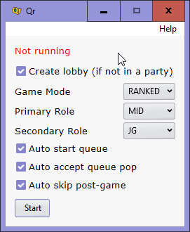

<h1 align="center">
  
    
  Qr
   
   
</h1>

<h4 align="center">LoL Auto-Accept & Insta-Lock</h4>
<h5 align="center"><i>Port of <a href="https://github.com/SaffatHasan/AutoQr">AutoQr</a></i></h5>

<h1 align="center">
  </a>  
</h1>

## Runtime Dependencies

- [sciter.dll](https://gitlab.com/sciter-engine/sciter-js-sdk/-/blob/f149f104dcd7fd0db6ca8157acce10f060f03afc/bin/windows/x32/sciter.dll) v4.4.8.38

## Development Dependencies

- [packfolder.exe](https://gitlab.com/sciter-engine/sciter-js-sdk/-/blob/f149f104dcd7fd0db6ca8157acce10f060f03afc/bin/windows/packfolder.exe)